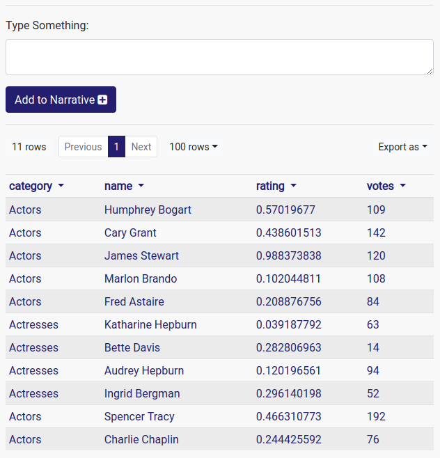
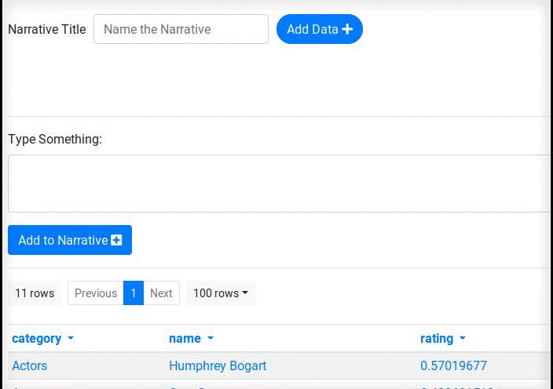
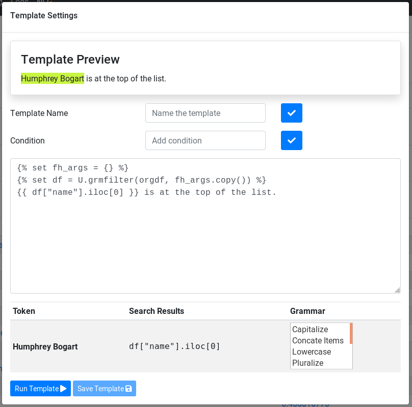

|Build Status|

nlg
===

Natural Language Generation component for
`Gramex <https://github.com/gramener/gramex>`__. The NLG module is
designed to work as a Python library, as well as a `Gramex
application <https://learn.gramener.com/guide/apps/#gramex-apps>`__.

The library:

1. Automatically creates tornado templates from English text in the
   context of a dataset.
2. Allows for modification and generalization of these templates.
3. Renders these templates as a unified narrative.

Installation
------------

The NLG library can be installed from PyPI as follows:

.. code:: bash

    $ pip install nlg
    $ python -m spacy download en_core_web_sm
    $ gramex setup ui

or from source as follows:

.. code:: bash

    $ git clone https://github.com/gramener/gramex-nlg.git
    $ cd gramex-nlg
    $ pip install -e .
    $ gramex setup ./app

Usage
-----

Using the Python library
~~~~~~~~~~~~~~~~~~~~~~~~

To get started, see the `example notebook here <https://github.com/gramener/gramex-nlg/tree/dev/examples/intro-narrative-api.ipynb>`_.

.. code:: python

    >>> import pandas as pd
    >>> from gramex import data

    >>> # load some data
    >>> df = pd.read_csv('iris.csv')

    >>> # specify a FormHandler operation - find the average sepal_width per species
    >>> fh_args = {'_by': ['species'], '_c': ['sepal_width|avg'], '_sort': ['sepal_width|avg']}

    >>> # Draw a sample
    >>> xdf = df.sample(frac=0.1, random_state=10)

    >>> # perform the FormHandler operation on the data
    >>> print(data.filter(xdf, fh_args.copy()))
          species  sepal_width|avg
    2   virginica             2.70
    1  versicolor             2.92
    0      setosa             3.15

    >>> # Write something about the output
    >>> from nlg.utils import load_spacy_model
    >>> text = nlp("The virginica species has the least average sepal_width.")

    >>> # Generate a template
    >>> from nlg.search import templatize
    >>> tmpl = templatize(text, fh_args, xdf)
    >>> print(tmpl)
    
    
    
    The {{ df["species"].iloc[0] }} species has the least average {{ fh_args["_sort"][0].lower() }}.

    >>> # Render the same template with new data.
    >>> print(render(df, tmpl).decode('utf8'))
    The versicolor species has the least average sepal_width|avg.

Using the NLG IDE
~~~~~~~~~~~~~~~~~

The NLG module ships with an IDE. The IDE is a `Gramex
application <https://learn.gramener.com/guide/apps/>`__.

To use it, install the NLG module as indicated above, and add the
following to your ``gramex.yaml``:

.. code:: yaml

    variables:
      NLG_ROOT:
        function: nlg.utils._locate_app_config()

    import:
      nlg:
        path: $NLG_ROOT
        YAMLURL: $YAMLURL/nlg

This configuration mounts the app at the ``/nlg/`` resource. Start gramex to access it.

The Gramex NLG IDE
------------------

The NLG component depends on two sources of information:

1. A source dataset, which can be uploaded on to the IDE. A dataset is
   uniquely identified with its filename. Once uploaded, the file
   persists and is available for selection from the app. Any *file* that
   makes a valid URL for
   `FormHandler <http://learn.gramener.com/guide/formhandler>`__ can be
   used with the NLG app.
2. A *narrative*, which is a collection of templates and rules around
   them. The narrative consists of the configuration which governs the
   rendered text. An existing narrative can be uploaded through the "Add
   Data" button, or can be created through the IDE. Once created, the
   narrative can be named and becomes available for selection from the
   "Add Data" modal.

The NLG IDE
-----------

The primary purpose of the IDE is to create or edit narratives based on
a dataset. Once a dataset has been selected, it is exposed in the IDE as
a `FormHandler
table <https://learn.gramener.com/guide/formhandler/#formhandler-tables>`__.

Users can now type English text into the IDE and add it to the
narrative. This automatically templatizes the text, and adds the
template to the narrative. For example, typing "Humphrey Bogart is at
the top of the list." does this:

This means that the input statement has been templatized and added to
the narrative. The part of the input text that was successfully
templatized is highlighted in green. Clicking on the spanner button next
to a template opens the `Template Settings <#template-settings>`__
modal.

Template Settings
-----------------

This dialog provides configuration options for all template attributes:

1. **Template Name** - Each template can optionally be named.
2. **Condition** - Any Python expression which evaluates to a boolean
   may be set as a condition, which controls whether the template is
   rendered.
3. The actual Tornado template itself can be edited. Any valid Tornado
   template is acceptable.
4. **Token Settings** - Every token from the input text that finds a
   match in the dataset or in FormHandler arguments (i.e. every token
   that is highlighted in the preview) is converted into a `template
   expression <https://www.tornadoweb.org/en/stable/template.html#syntax-reference>`__.
   Such tokens have their own attributes, as follows:

   -  **Token search results** - if a token is found in more than one
      place (say, a dataframe cell as well as a FormHandler argument),
      this setting allows the user to select the right result.
   -  **Grammar options** - the NLG engine may automatically apply
      certain string formatting or lexical operations to the template
      expression to make it match the input text. Any number of these
      operations can be enabled / disabled through this setting.
   -  **Make variable** - a token may be set as a local variable within
      the template.
   -  **Ignore** - the template expression corresponding to the token
      may be ignored, and set back to the literal input text.

5. **Run Template** - Run the current template against the dataframe and
   preview its output.
6. **Save Template** - Save the template. Note that this is required if
   the template has been manually edited in the textarea.

Naming and Saving a Narrative
-----------------------------

Once a narrative has been fully configured, it can be named and saved.
Doing so causes it to appear the narrative dropdown menu on the app.

Sharing a Narrative
-------------------

After a narrative has been named and saved, it be shared in two modes:

1. **IDE mode** - This option lets users copy a URL that redirects to
   the IDE, with the current dataset and the current narrative set in
   the session.
2. **Embed mode** - Copy an HTML snippet to embed into a page which
   contains a Formhandler table. The template will render live as the
   table changes.

Glossary: Grammar of Data-Driven Narratives
===========================================

This section describes the building blocks of Gramex's approach to natural language generation.
These concepts serve as primitives to the logic and automation capabilities of the NLG engine.

1. **Narrative** - A *narrative* is a piece of text written by a user or generated by a machine which contains facts about a dataset.
   A narrative in its entirity is assumed to be a function of three items:

   a. A dataset
   b. Operations on that dataset
   c. Some "source text" provided by the user.

   For example, the following is a narrative about the `Fisher Iris dataset <https://archive.ics.uci.edu/ml/datasets/Iris>`_.

      The iris dataset contains measurements from a hundred and fifty samples of three unique species of the iris flower - setosa, versicolor and virginica. The species are equally distributed within the dataset, so that each species has fifty samples. For each sample, four measurements are taken - sepal width, petal width, sepal width and sepal length. The average petal length of the setosa is significantly less than that of versicolor or virginica. The average petal width of virginica is much higher than that of versicolor. However, there is no pair of features that can uniquely identify a species. The presence of such properties makes the iris dataset ideal for explaining machine learning concepts.

2. **Nugget** - A *nugget* is ideally a single sentence which conveys a fact about the data. Each sentence in the example narrative except the last two is a nugget. Note that each nugget derives its facts from the source data directly, or from the result of some operation on the data. For example, the following nugget

   The average petal length of the setosa is significantly less than that of versicolor or virginica.
   
   derives from a groupby-and-average operation on one column of the dataset. Some nuggets, like the one enumerating the number of samples in the dataset, derive from the raw dataset, *not* from the result of any operations on it. A narrative is essentially an ordered collection of nuggets.

3. **Variables**  - A *variable* is a piece of text which can change with the data or the operations performed on it. Here is a reproduction of the example narrative, with all variables shown in bold.

      The iris dataset contains measurements from **a hundred and fifty** samples of **three** unique species of the iris flower - **setosa, versicolor and virginica**. The species are equally distributed within the dataset, so that each species has **fifty** samples. For each sample, **four** measurements are taken - **sepal width, petal width, sepal width and sepal length**. The **average petal length** of the setosa is significantly **less** than that of versicolor or virginica. The **average petal width** of virginica is much **higher** than that of versicolor. However, there is no pair of features that can uniquely identify a species. The presence of such properties makes the iris dataset ideal for explaining machine learning concepts.

   Note that each variable has two defining components:

   * a *source text*, as initially provided by the user
   * one or more *formulae*, which compute the value of the variable for a specific instance of the data. Note that the source text of a variable may be found in multiple places within a dataset, and as such, a variable may have multiple formulae - one of which will have to be preferred by the user.

   For example, for the first variable in example narrative, "hundred and fifty" is the source text, and the formula is any machine code that counts the number of rows in the dataset and translates it into a human-readable form. A variable may additionally have other attributes, like:

   * a set of linguistic *inflections* which determine the form of the rendered variable text - these are distinct from the formula itself, in that the formula creates the base form of the text and inflections modify the base form.
   * a *name* used to identify the variable within the template of the nugget

Thus, narratives are composed from nuggets, and nuggets from variables. This grammar allows the NLG engine to approach the problem of data-driven, machine-generated narratives in a more *compositional* manner than a *generative* one.

.. |Build Status| image:: https://travis-ci.org/gramener/gramex-nlg.svg?branch=dev
   :target: https://travis-ci.org/gramener/gramex-nlg

